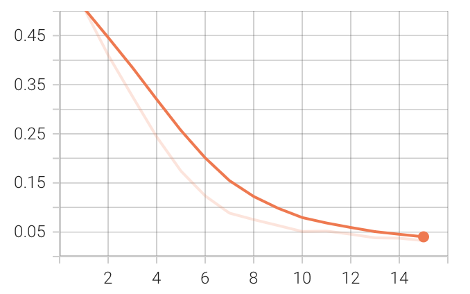

# Trained Model

This model is trained on the OLID dataset on NVIDIA A100 GPU with 40GB memory. If you want to train the model on your own machine, follow the instructions in the repository's README.

The model is trained for 15 epochs and 32 batch size with a learning rate of 2e-5. The maximum sequence length is set to 128 tokens. The training script saves the best model based on the F1 score on the validation set.

## Download the Model
Link: https://drive.google.com/file/d/1MJ7AHiumIpTMJZAqJKyj8eCXeGhHr4-o/view?usp=sharing

To download the model with python, you can use the following script:

```python
import gdown
url = 'https://drive.google.com/uc?id=1MJ7AHiumIpTMJZAqJKyj8eCXeGhHr4-o'
output = 'multiencoder_model.pt'
gdown.download(url, output, quiet=False)
```

## Loss curve
The training loss and validation loss curves are shown below:

The model is still not overfitting, so you can train it for more epochs to improve the performance.